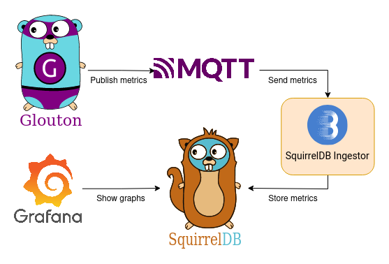

# SquirrelDB Ingestor

[](https://goreportcard.com/report/github.com/bleemeo/squirreldb-ingestor)
[](https://github.com/bleemeo/squirreldb-ingestor/blob/master/LICENSE)
[](https://hub.docker.com/r/bleemeo/squirreldb-ingestor/tags)
[](https://hub.docker.com/r/bleemeo/squirreldb-ingestor)

SquirrelDB Ingestor reads metrics sent by [Glouton](https://github.com/bleemeo/glouton) over MQTT 
and store  them in [SquirrelDB](https://github.com/bleemeo/squirreldb) (or any other component
compatible with Prometheus remote write).

An example Docker Compose with Glouton, SquirrelDB and Grafana is available
[here](https://github.com/bleemeo/glouton/tree/master/examples/mqtt).

To use authenticated MQTT connections and a high availability setup, check out the [setup example](#setup-example).



## Run

SquirrelDB Ingestor can be run with Docker or as a binary.

### Docker

```sh
docker run -d --name="squirreldb-ingestor" bleemeo/squirreldb-ingestor
```

### Binary

Grab the latest binary [release](https://github.com/bleemeo/squirreldb-ingestor/releases/latest) and run it:

```sh
./squirreldb-ingestor
```

## Configuration

The options can be set with environment variables or command line arguments.

-  `--log-level`, env: `INGESTOR_LOG_LEVEL` , default: info  
Set the log level. The available levels are: trace, debug, info, warn, error, fatal, panic and disabled.  

### Remote storage

-  `--remote-write-url`, env: `INGESTOR_REMOTE_WRITE_URL`, default: http://localhost:9201/api/v1/write  
The Prometheus remote write API URL.

### MQTT

-  `--mqtt-broker-url`, env: `INGESTOR_MQTT_BROKER_URL`, default: tcp://localhost:1883  
The MQTT Broker URL, must begin by `tcp://`, or `ssl://`.

-  `--mqtt-username`, `--mqtt-password`, env: `INGESTOR_MQTT_USERNAME`, `INGESTOR_MQTT_PASSWORD`  
The credentials used to authenticate with MQTT. Note that the username is also used as the client ID.

-  `--mqtt-ssl-insecure`, env: `INGESTOR_MQTT_SSL_INSECURE`  
Allow insecure SSL connection.

-  `--mqtt-ca-file`, env: `INGESTOR_MQTT_CA_FILE`  
Provide your own SSL certificate, this should be the path to a PEM file.

- `--mqtt-id`, env: `INGESTOR_MQTT_ID`
If set, the ingestor listens to the MQTT topic `v1/agent/fqdn/data/MQTT_ID`. This is useful only if you use 
[NATS subject mapping](https://docs.nats.io/running-a-nats-service/configuration/configuring_subject_mapping), 
to configure the topic this ingestor should listen on. More details are available in the [setup example](#nats-subject-mapping).

## Setup example

In this example, we are going to setup a Grafana dashboard from metrics sent by two Gloutons over MQTT.

A docker compose is available to start a monitoring stack with two Gloutons, SquirrelDB Ingestor, NATS, 
SquirrelDB and Grafana. It provides a NATS cluster with three nodes for high availability, and two ingestors.

```sh
cd examples/ingestor_ha
docker-compose up -d
```

Now you can check that the ingestor is connected to MQTT. The logs should say `MQTT connection established`.
```sh
docker-compose logs -f squirreldb-ingestor 
```

Also check that the agents connected to MQTT, you should see `Open Source MQTT connection established`:
```sh
docker-compose logs -f glouton-1 glouton-2
```

Then go to the Grafana dashboard at http://localhost:3000/d/83ceCuenk/, and log in with the user
"admin" and the password "password". You can monitor all your servers from this dashboard.

### High availabity

This setup provides a NATS cluster to have high availability for MQTT.

SquirrelDB, Cassandra and Redis are running with a single node in the example, 
but they can also be scaled, an example is available
[here](https://github.com/bleemeo/squirreldb/tree/master/examples/squirreldb_ha).

For true high availability, each component must run on a different node, which is is not done by the docker compose.

## Connecting your agents

To connect your agent to the SquirrelDB Ingestor, you need to edit its configuration. Here is an example
configuration, you should change the hosts to the nodes running NATS, and edit the username and password.

```yaml
agent:
  metrics_format: prometheus

bleemeo:
  enable: false

mqtt:
  enable: true
  hosts: 
    - 127.0.0.1
  port: 1883
  username: server1
  password: passw0rd

# Allow node exporter metrics.
metric:
  allow_metrics:
    - node_*
```

To start a new agent with this configuration you can use Docker. The following command supposes
that you wrote the configuration to a file in the current directory called `glouton.conf`.

```sh
docker run -d --name="bleemeo-agent" \
    -v /var/lib/glouton:/var/lib/glouton -v /var/run/docker.sock:/var/run/docker.sock -v /:/hostroot:ro \
    -v $(pwd)/glouton.conf:/etc/glouton/conf.d/90-mqtt.conf \
    -e  GLOUTON_BLEEMEO_ENABLE='false' --pid=host --net=host \
    --cap-add SYS_PTRACE --cap-add SYS_ADMIN bleemeo/bleemeo-agent
```

## Authentication and autorizations with NATS

An example NATS cluster configuration is available in `examples/ingestor_ha/nats.conf`. 
For each new user, you need to add it the `authorization` block of the configuration with the right
permissions to allow it to only publish to a single topic. 

Let's say we want to monitor two servers, `server1.example.com` and `server2.example.com`. 
The autorizations should look like this:

```conf
authorization {
    # Allow the ingestor to listen on the MQTT topic "v1/agent/+/data".
    # https://docs.nats.io/running-a-nats-service/configuration/mqtt#mqtt-topics-and-nats-subjects
    # We also allow need to allow "$MQTT.sub.>" because NATS uses this topic to store durable subsription.
    # https://docs.nats.io/running-a-nats-service/configuration/mqtt/mqtt_config#special-permissions
    ingestor_perms = {
        subscribe = ["v1.agent.*.data", "$MQTT.sub.>"]
    }

    # Glouton publishes its metrics to the `v1/agent/fqdn/data` topic, with `fqdn` replaced by the host FQDN.
    # `.` are replaced by `,` in the FQDN because NATS doesn't support `.` in MQTT topics.
    # On Linux, you can get your FQDN with "hostname -f".
    server1_perms = {
        publish = ["v1.agent.server1,example,com.data"]
    }

    server2_perms = {
        publish = ["v1.agent.server2,example,com.data"]
    }

    users = [
        {user: ingestor, password: passw0rd, permissions: $ingestor_perms, allowed_connection_types: ["MQTT"]}
        {user: server1, password: passw0rd, permissions: $server1_perms, allowed_connection_types: ["MQTT"]}
        {user: server2, password: passw0rd, permissions: $server1_perms, allowed_connection_types: ["MQTT"]}
    ]
}
```

## Scaling the ingestor

[NATS subject mapping](https://docs.nats.io/running-a-nats-service/configuration/configuring_subject_mapping)
allows to distribute messages received on a topic to multiple topics. This make it possible to use multiple
ingestors. Note that this works only with nats-server > v2.9.4.

For example to run two ingestors you can use the following NATS mapping configuration:
```conf
mappings = {
  # Distribute the messages received on "v1/agent/+/data" to two topics.
  # One ingestor listens on "v1/agent/+/data/1" and the other on "v1/agent/+/data/2".
  v1.agent.*.data: [
    { destination: v1.agent.$1.data-1, weight: 50% },
    { destination: v1.agent.$1.data-2, weight: 50% }
  ]
}
```

Then you need to pass the argument `--mqtt-id 1` to the first ingestor and 
`--mqtt-id 2` to the second.

Note that running multiple ingestors doesn't give you high availability, if one ingestor
is down, the messages won't be processed until it's restarted (but you won't lose any metric).


## Contributing

See [CONTRIBUTING.md](CONTRIBUTING.md).
